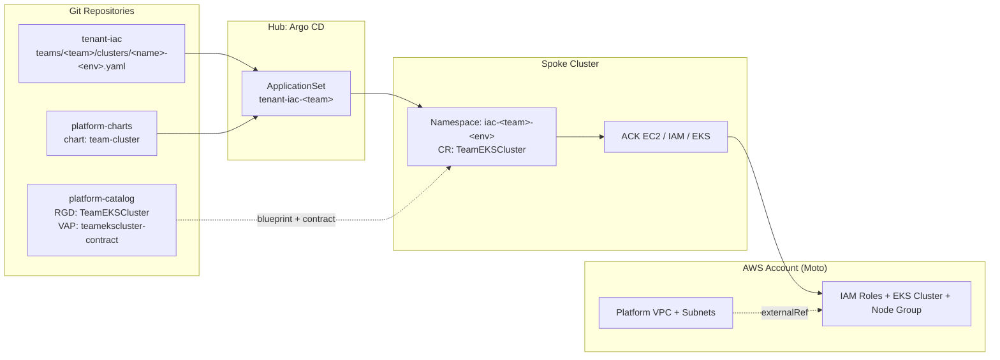

# tenant-iac

> **Self-service tenant EKS clusters on the lab platform.**

This repository enables engineering teams to declaratively request, configure, and maintain EKS clusters through GitOps. A single YAML claim file submitted via Pull Request is reconciled by the platform into IAM roles, an EKS cluster, and managed node groups within the team's designated environment account in Moto Cloud, attached to the platform-owned tier-1 network.

---

## How It Works



1. **Self-Service Claim**: A team commits a file to `teams/<team>/clusters/<name>-<env>.yaml`.
2. **Automated CI Validation**: GitHub Actions runs `cluster-checks`, verifying the JSON schema, DNS naming, environment bounds, node sizing, and renders offline through `kubeconform`.
3. **Pull Request Approval**:
   - `dev` and `test` clusters can be merged upon passing CI.
   - `prod` clusters (`*-prod.yaml`) require explicit CODEOWNERS review and approval from `@brunobml`.
4. **GitOps Reconciliation**: Argo CD detects the claim, templates the golden chart (`team-cluster:1.0.0`), and deploys a `TeamEKSCluster` custom resource into spoke namespace `iac-<team>-<env>`.
5. **Infrastructure Orchestration**: Kro reconciles the resource graph into AWS IAM roles, an EKS cluster, and a managed nodegroup via ACK controllers on the platform's tier-1 network.

---

## Cluster Claim Specification

Create a file at `teams/<team>/clusters/<name>-<env>.yaml`:

```yaml
team: team-data            # must match parent directory teams/team-data/
name: analytics            # cluster name prefix; resources named <team>-<name>-<env>-*
env: dev                   # dev | test | prod
kubernetesVersion: "1.33"  # allowed: 1.32, 1.33, 1.34
network: platform-default  # tier-1 network owned and managed by the platform
nodeGroup:
  instanceType: t3.medium  # allowed: t3.medium, t3.large, m5.large
  minSize: 1               # minimum 1
  desiredSize: 2           # minSize <= desiredSize <= maxSize
  maxSize: 3               # <= 3 for dev/test, <= 5 for prod
```

### Constraints & Guardrails

| Parameter | Allowed Values / Constraints | Enforcement |
|---|---|---|
| `team` | Lowercase DNS label (`^[a-z][a-z0-9-]{0,18}[a-z0-9]$`), 2–20 characters | Schema + VAP |
| `name` | Lowercase DNS label (`^[a-z][a-z0-9-]{0,18}[a-z0-9]$`), 2–20 characters | Schema + VAP |
| `env` | `dev`, `test`, `prod` | Schema + VAP |
| `kubernetesVersion` | `"1.32"`, `"1.33"`, `"1.34"` | Schema + VAP |
| `network` | `platform-default` (the platform owns and manages the VPC/subnets) | Schema + VAP |
| `nodeGroup.instanceType` | `t3.medium`, `t3.large`, `m5.large` | Schema + VAP |
| `nodeGroup.minSize` | $\ge 1$ | Schema + VAP |
| `nodeGroup.desiredSize` | $\ge \text{minSize}$ and $\le \text{maxSize}$ | Relational check + VAP |
| `nodeGroup.maxSize` | $\le 3$ for `dev`/`test`; $\le 5$ for `prod` | Schema + VAP |
| Target Namespace | Must match `iac-<team>-<env>` | VAP + ApplicationSet |
| Target Account | `dev`/`test` $\rightarrow$ `111111111111` (nonprod); `prod` $\rightarrow$ `222222222222` (prod) | CARM Namespace Annotation |
| Deletion Policy | `delete` for `dev`/`test`; `retain` for `prod` | Kro Blueprint CEL |

---

## Repository Layout

```
.
├── .github/
│   ├── CODEOWNERS             # Prod approvals enforced by platform owner
│   └── workflows/
│       └── ci.yaml            # cluster-checks CI workflow
├── schema/
│   └── cluster.schema.json    # JSON Schema definition for cluster claims
├── teams/
│   ├── README.md              # Squad documentation
│   └── <team>/
│       └── clusters/
│           └── <name>-<env>.yaml
└── tests/
    └── fixtures/
        ├── positive/          # Valid sample claims for testing
        └── negative/          # Out-of-range claims rejected by CI
```

---

## Local Verification

Run the test suite locally from the `gitops-control-plane` repository:

```bash
make ci-iac
```
# CI verified
